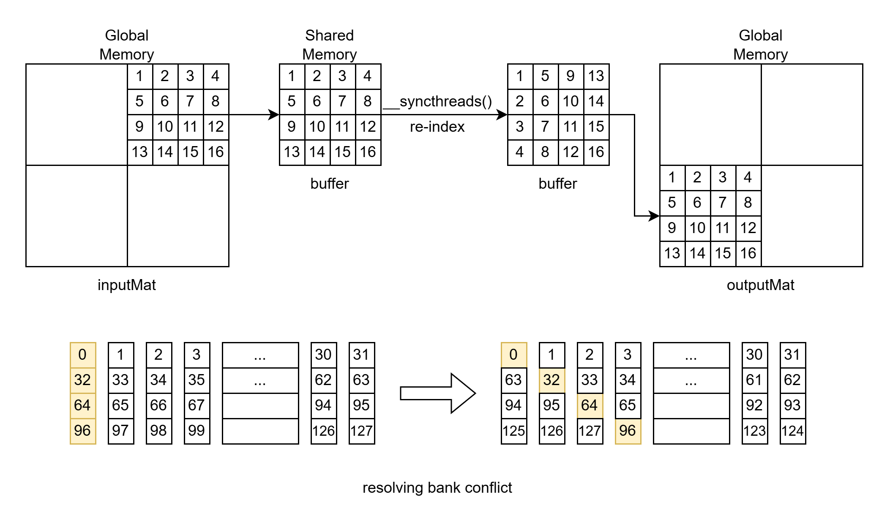
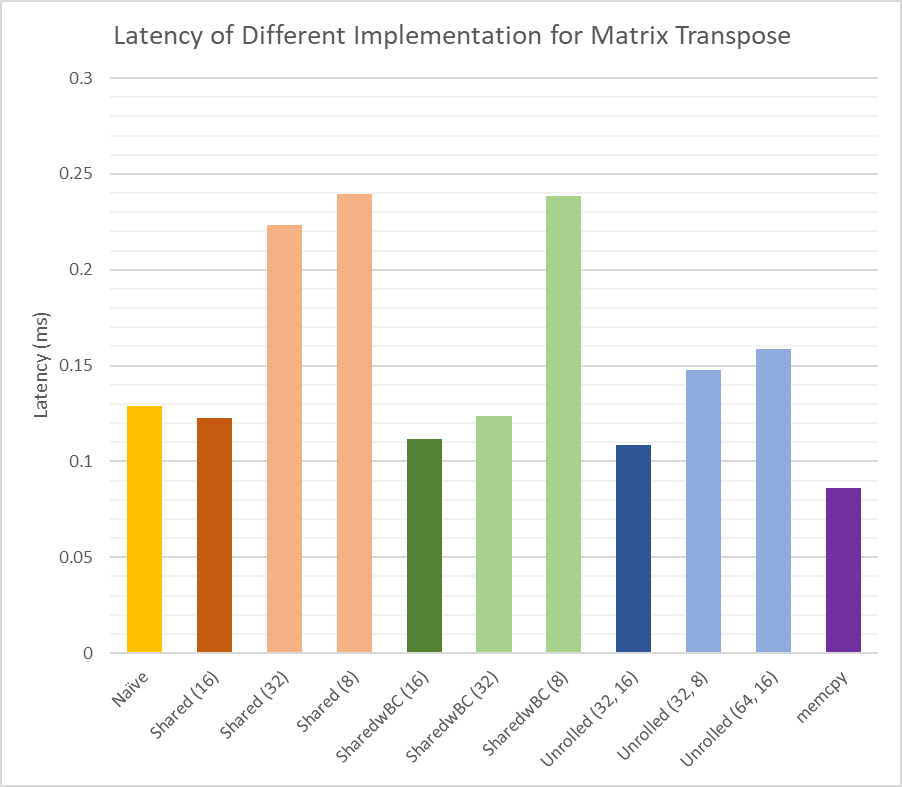

# Optimizing Matrix Transpose on GPUs

## 1 Implementation of Matrix Transpose

In this lab, our goal is to implement and evaluate the matrix transpose operation. We aim to transpose an $N \times N$ single-precision floating-point matrix, with the input and output stored in separate memory arrays. Different versions of the matrix transpose will be implemented to compare their performance.

### 1.1 CPU Implementation of Matrix Transpose

On the CPU, we use the simplest method for matrix transposition, which involves a nested loop structure. This method is optimized with the `-O2` compiler flag and has a time complexity of $O(n^2)$.

```c
void transposeCPU(float *inputMat, float *outputMat, int N)
{
    for (int i = 0; i < N; i++)
    {
        for (int j = 0; j < N; j++)
        {
            outputMat[j * N + i] = inputMat[i * N + j];
        }
    }
}
```

### 1.2 GPU Implementation of Matrix Transpose

```c
__global__ void transposeNaive(float *inputMat, float *outputMat, int N)
{
    int in_x = blockIdx.x * blockDim.x + threadIdx.x;
    int in_y = blockIdx.y * blockDim.y + threadIdx.y;

    if (in_x < N && in_y < N)
    {
        outputMat[in_y * N + in_x] = inputMat[in_x * N + in_y];
    }
}
```

In this naive GPU implementation of the matrix transpose, each thread is responsible for moving an element from `inputMat` to the corresponding position in `outputMat`. The kernel function calculates the indices `in_x` and `in_y` for the element that the current thread handles in the input matrix, and then copies this element to the output matrix. Assuming all threads execute in parallel, the time complexity can be $O(1)$.

While the naive approach theoretically achieves optimal performance, it does not fully exploit the characteristics of Global Memory. In Global Memory, threads within the same block read from consecutive positions but write to positions at intervals. For optimal performance, we want the write operations to be relatively contiguous, facilitating more coalesced memory accesses. To achieve this, we can utilize Shared Memory for temporary data storage and transfer.

### 1.3 Optimization Using Shared Memory

```c
template <int BLOCK_SIZE>
__global__ void transposeShared(float *inputMat, float *outputMat, int N)
{
    __shared__ float buffer[BLOCK_SIZE][BLOCK_SIZE];
    int out_block_x = blockIdx.x * BLOCK_SIZE;
    int out_block_y = blockIdx.y * BLOCK_SIZE;
    int in_x = out_block_y + threadIdx.y;
    int in_y = out_block_x + threadIdx.x;
    int out_x = out_block_x + threadIdx.y;
    int out_y = out_block_y + threadIdx.x;

    if (in_x < N && in_y < N)
    {
        buffer[threadIdx.x][threadIdx.y] = inputMat[in_x * N + in_y];
    }
    __syncthreads();
    if (out_x < N && out_y < N)
    {
        outputMat[out_x * N + out_y] = buffer[threadIdx.y][threadIdx.x];
    }
}
```

In this version of matrix transpose implementation, we first declare an array in Shared Memory. This array is shared among threads within a thread block and has the same lifespan as the block.

Blocked matrix transpose is based on the mathematical fact that if a matrix can be blocked as $A = (A_{ij})$, its transpose is $A^T = (A^T_{ji})$. Each thread block loads a blocked portion of the input matrix from Global Memory into Shared Memory and writes back this blocked portion in the order of the transpose to the corresponding position in the output matrix in Global Memory. It is important to insert `__syncthreads();` after loading into Shared Memory to ensure that all threads in the block have finished loading before proceeding to the write-back operation.

This approach ensures that the block's access to Global Memory is localized.

### 1.4 Considering Bank Conflicts

For a Shared Memory space with $32 \times 32$ elements, all elements in a column are mapped to the same bank, resulting in bank conflicts: reading a column data causes 32-way bank conflicts. To avoid this, we can increase the number of columns in the Shared Memory space from 32 to 33, so that the elements in a column will not reside in the same bank.

However, we adopt an alternative approach to avoid having the same column data in the same bank by staggering the elements in the same column.

```c
template <int BLOCK_SIZE>
__global__ void transposeSharedwBC(float *inputMat, float *outputMat, int N)
{
    __shared__ float buffer[BLOCK_SIZE][BLOCK_SIZE];
    int out_block_x = blockIdx.x * BLOCK_SIZE;
    int out_block_y = blockIdx.y * BLOCK_SIZE;
    int in_x = out_block_y + threadIdx.y;
    int in_y = out_block_x + threadIdx.x;
    int out_x = out_block_x + threadIdx.y;
    int out_y = out_block_y + threadIdx.x;

    if (in_x < N && in_y < N)
    {
        buffer[threadIdx.x][(threadIdx.x + threadIdx.y) % BLOCK_SIZE] = inputMat[in_x * N + in_y];
    }
    __syncthreads();
    if (out_x < N && out_y < N)
    {
        outputMat[out_x * N + out_y] = buffer[threadIdx.y][(threadIdx.x + threadIdx.y) % BLOCK_SIZE];
    }
}
```



### 1.5 Performing More Computations per Thread

In the previous implementation, each thread only performed computations for one element. However, in reality, the kernel function can execute multiple independent instructions in parallel. By unrolling the loop, we can make each thread perform more computations. For example, setting TILE to 32 and SIDE to 8 requires only $32 \times 8$ threads in a block, with each thread responsible for computing 4 elements, while the previous implementation would require $32 \times 32$ threads.

```c
template <int TILE, int SIDE>
__global__ void transposeUnrolled(float *inputMat, float *outputMat, int N)
{
    __shared__ float buffer[TILE][TILE];
    int out_block_x = blockIdx.x * TILE;
    int out_block_y = blockIdx.y * TILE;
    int in_x = out_block_y + threadIdx.y;
    int in_y = out_block_x + threadIdx.x;
    int out_x = out_block_x + threadIdx.y;
    int out_y = out_block_y + threadIdx.x;
    #pragma unroll
    for (int offset = 0; offset < TILE; offset += SIDE)
    {
        if (in_y < N && in_x + offset < N)
            buffer[threadIdx.y + offset][(threadIdx.x + threadIdx.y + offset) % TILE] = inputMat[(in_x + offset) * N + in_y];
    }
    __syncthreads();
    #pragma unroll
    for (int offset = 0; offset < TILE; offset += SIDE)
    {
        if (out_y < N && out_x + offset < N)
           outputMat[(out_x + offset) * N + out_y] = buffer[threadIdx.x][(threadIdx.x + threadIdx.y + offset) % TILE];
    }
}
```

## 2 Experiment

### 2.1 Experimental Setup


The experiment was conducted on an NVIDIA A800-SXM4-80GB GPU with a peak FP32 performance of 19.5 TFLOPS. It has 40GB of high-speed HBM2e memory with a bandwidth of 1935 GB/s. The GPU features 128 streaming multiprocessors.

### 2.2 Code

Instead of using `<chrono>`, we use `cudaEventRecord` to measure GPU-side time because executing the kernel function may be asynchronous to the CPU. The `transposeGPUWrapper` in the code is a wrapper for the kernel function. Before measuring the runtime of the kernel function, we execute it once for warm-up to fully utilize the GPU's performance and accurately measure the real performance of different implementation versions.

```c
float measureGPUTime(float *inputMat, float *outputMat, int N, int imp)
{
    // malloc
    float *inputMatGPU;
    float *outputMatGPU;
    cudaMalloc((void **)&inputMatGPU, N * N * sizeof(float));
    cudaMalloc((void **)&outputMatGPU, N * N * sizeof(float));

    // copy inputMat from host to device
    cudaMemcpy(inputMatGPU, inputMat, N * N * sizeof(float), cudaMemcpyHostToDevice);

    // transpose
    transposeGPUWrapper(inputMatGPU, outputMatGPU, N, imp); // warm-up

    cudaEvent_t start, stop;
    cudaEventCreate(&start);
    cudaEventCreate(&stop);
    cudaEventRecord(start);

    transposeGPUWrapper(inputMatGPU, outputMatGPU, N, imp);

    cudaEventRecord(stop);
    cudaEventSynchronize(stop);
    float milliseconds = 0;
    cudaEventElapsedTime(&milliseconds, start, stop);

    // copy outputMat from device to host
    cudaMemcpy(outputMat, outputMatGPU, N * N * sizeof(float), cudaMemcpyDeviceToHost);

    // free
    cudaFree(inputMatGPU);
    cudaFree(outputMatGPU);

    return milliseconds;
}
```

We tested all versions on a $4000 \times 4000$ ($N = 4000$) single-precision floating-point matrix. We executed the kernel function for each implementation version with different block sizes. The runtime was measured using the aforementioned code, and the results were verified to match that of the CPU implementation.

We invoked the kernel function as follows:

```c
dim3 blockSize(16, 16);
dim3 gridSize((N + blockSize.x - 1) / blockSize.x, (N + blockSize.y - 1) / blockSize.y);
transposeShared<16><<<gridSize, blockSize>>>(inputMat, outputMat, N);
```

### 2.3 Results

The experiment evaluated 12 cases of matrix transpose implementations:

- CPU: CPU implementation
- Naive: Naive GPU implementation
- Shared: GPU implementation using shared memory with block sizes of 8, 16, and 32
- SharedwBC: GPU implementation using shared memory considering bank conflicts with block sizes of 8, 16, and 32
- Unrolled: GPU implementation with loop unrolling using `(TILE, SIDE)` values of (32, 16), (32, 8), and (64, 16)
- memcpy: `cudaMemcpy(inputMat, outputMat, N * N * sizeof(float), cudaMemcpyDeviceToDevice);` used to determine the upper limit of matrix transpose optimization

The results are shown in the following graph:



In the Shared and SharedwBC implementations, the block size of 16 achieves the best performance. Additionally, for a block size of 32, SharedwBC exhibited significantly lower latency compared to Shared, highlighting the substantial impact of bank conflicts on performance when the block size matches the number of banks. In the Unrolled implementation, the lowest latency is achieved with TILE set to 32 and SIDE set to 16. 

Next, the best performance among different versions is shown in the following table:

|Implementation|Latency (ms)|Bandwidth (GB/s)|Speedup|
|:--:|:--:|:--:|:--:|
|CPU|50.4135|2.539|1|
|Naive|0.129024|992.06|391|
|Shared|0.122880|1041.67|410|
|SharedwBC|0.111616|1146.79|451|
|Unrolled|0.108544|1179.25|464|
|memcpy|0.086016|1488.10|586|


The results indicate that the applied optimization techniques improve performance. However, choosing an appropriate block size may be more crucial than selecting the optimal implementation approach.

## 3 Conclusion

Matrix transpose is a fundamental operation in linear algebra and has various applications in numerical computations. Implementing matrix transpose efficiently can lead to performance improvements, especially when working with large matrices.

In this experiment, we compared different GPU implementations of matrix transpose. Our findings revealed that utilizing Shared Memory and mitigating bank conflicts can significantly improve performance. The extent of the performance improvement varies depending on the GPU model and its specifications, such as block size.

Optimizing matrix transpose exemplifies how parallel computing techniques can enhance performance in numerical computations. By leveraging the power of GPUs and optimizing algorithms for parallel execution, we can achieve faster and more efficient computations across various domains.